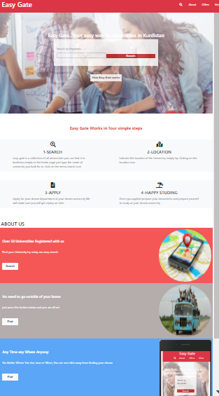

# University Directory website

> This is a University directory website that helps users navigate through Universities easily and find their dream University,
currently, there are four main pages, "The Search page, The result page, the sign up page and the details page" with a fixed navigation help users navigate through the website.

Additional description about the project and its features.

## Built With

- HTML & CSS
- Bootstrap

## Live Demo

[Live Demo Link](https://arikarim.github.io/Capstone-Projectt-1/)

## Author

- GitHub: [@arikarim](https://github.com/arikarim)
- LinkedIn: [AriKarim](https://www.linkedin.com/in/ari-karim-523bb81b3)

## Credit to real Author
Credit to the author Mathew NJuguna and others on behalf for design of this project.

## Show your support

Give a ⭐️ if you like this project!!

## 📝 License

This project is [MIT](LICENSE) licensed.
